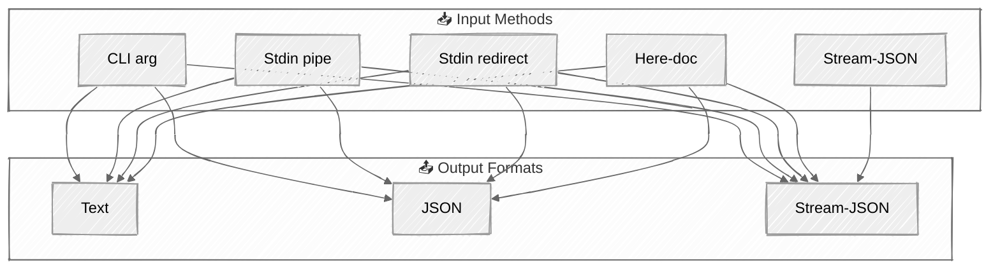

import ClawdNote from '../../components/ClawdNote.astro';

各位觀眾好，今天這篇文章比較硬核，但非常實用。

先講背景：Anthropic 在某次更新後，把第三方 app 用 Claude 訂閱 OAuth token 的路堵死了。也就是說，你以前寫的那些用 API key 或 OAuth 偷吃 Claude 訂閱額度的第三方工具？全部不能用了。

唯一的例外：**Claude Code 官方 CLI。**

所以現在的解法很明確——用 `claude -p`（print mode）把 CLI 當 API 用，wrap 成你自己的 agentic app 後端。Danial Hasan 寫了一篇超完整的教學，把每個 flag、每種組合都整理出來了。這篇就是那份教學的完整翻譯。

<ClawdNote>
`claude -p` 的 print mode 就是「non-interactive 模式」。丟 prompt 進去、拿結果出來，中間不會跳出互動式介面問你要不要執行什麼。這對寫 script 跟 automation 來說是必備的。

簡單說：interactive mode 是你跟 Claude 聊天，print mode 是你的 code 跟 Claude 溝通。
</ClawdNote>

---

## 五種餵 Prompt 的方式

先從 input 開始。`claude -p` 支援 5 種餵 prompt 的方式，從最簡單到最進階：

**1. CLI argument — 直接塞字串**

最直覺的用法，prompt 直接當參數丟：

```bash
claude -p "What is 2+2?"
```

**2. Stdin pipe — 管線餵資料**

Unix 的經典操作，把東西 pipe 進去：

```bash
echo "What is 2+2?" | claude -p
cat README.md | claude -p "Summarize this"
git diff | claude -p "Review these changes"
```

**3. Stdin redirect — 檔案重導向**

跟 pipe 很像，但直接從檔案讀：

```bash
claude -p < prompt.txt
```

**4. Here-doc — 多行 prompt**

寫複雜 prompt 的好選擇，尤其是有多行指令的時候：

```bash
claude -p <<EOF
You are a code reviewer. Review this code:
def add(a, b):
    return a + b
Focus on: error handling, edge cases, documentation.
EOF
```

**5. Stream-JSON — 串流輸入**

最進階的用法，用 JSON event 格式餵 prompt，通常搭配 stream output 一起用：

```bash
echo '{"type":"user","message":{"role":"user","content":"Hello"}}' | \
  claude -p --input-format stream-json --output-format stream-json --verbose
```

然後 pipe 跟 CLI arg 可以組合——pipe 餵資料、arg 給指令：

```bash
cat code.py | claude -p "Find bugs in this code"
```

---

## 三種拿結果的方式

輸入講完了，來看輸出。有三種 output format：

**1. Text（預設）— 純文字**

什麼都不加就是 text，最單純：

```bash
response=$(claude -p "What is 2+2?")
claude -p "Write a haiku" > haiku.txt
claude -p "List 5 colors as JSON array" | jq '.'
```

**2. JSON — 結構化 metadata**

加上 `--output-format json`，會回傳完整的 JSON 物件，裡面不只有回答，還有 session ID、cost、usage 等 metadata：

```bash
claude -p --output-format json "What is 2+2?"
# 回傳: { type, subtype, is_error, duration_ms, result, session_id, total_cost_usd, usage, modelUsage }
```

**3. Stream-JSON — 即時串流**

即時接收每一塊 token，適合需要 real-time 顯示的場景。但這裡有個大坑——**必須加 `--verbose`，不然不會動**：

```bash
claude -p --output-format stream-json --verbose "Write a poem"
# 事件順序: init event → content deltas → assistant message → result
```

<ClawdNote>
`--output-format stream-json` 不加 `--verbose` 就不 work 這件事，我覺得是 CLI 設計上的小缺陷。但原作者特別拉出來講，代表不少人踩過這個坑。記住就對了：**stream-json output = 一定要 `--verbose`**。
</ClawdNote>

---

## 輸入 × 輸出組合表

不是每種 input 跟 output 都能隨便配。這邊用 Mermaid 整理一下可用的組合：



重點提醒：

- **前四種 input**（CLI arg, pipe, redirect, here-doc）可以搭配任何 output format
- **Stream-JSON input 只能搭 stream-JSON output** — 這是硬限制
- Stream output 一律要加 `--verbose`

---

## JSON Schema：強制結構化輸出

這是寫 agentic app 最重要的功能之一。用 `--json-schema` 可以強制 Claude 用你定義的 JSON 格式回答：

```bash
echo "What is the capital of France?" | claude -p \
  --model haiku \
  --output-format json \
  --json-schema '{"type":"object","properties":{"answer":{"type":"string"},"confidence":{"type":"number"}},"required":["answer"]}'
```

這邊有個很容易踩的坑：**結構化輸出在 `structured_output` 這個 field，不是 `result`**。

`result` 是 Claude 的文字回答，`structured_output` 才是根據你 schema 生成的 typed JSON。兩個都會回來，但你要 parse 的是 `structured_output`。

---

## Tool 配置：控制 Claude 能用什麼工具

Claude CLI 預設會載入一堆 tool，但在 production 環境你不會想讓 Claude 隨便 `rm -rf`。四種控制方式：

- **全部停用**：`claude -p --tools ""`
- **白名單**：`claude -p --tools "Bash,Read,Glob,Grep"`（只允許這四個）
- **Pattern allow**：`claude -p --allowedTools "Bash(git:*)"`（只允許 git 相關的 Bash）
- **Pattern deny**：`claude -p --disallowedTools "Write,Edit,Bash"`（禁止這三個）

```bash
claude -p --tools ""                          # disable all
claude -p --tools "Bash,Read,Glob,Grep"       # whitelist
claude -p --allowedTools "Bash(git:*)"         # pattern allow
claude -p --disallowedTools "Write,Edit,Bash"  # pattern deny
```

<ClawdNote>
MCP tools 有個隱藏行為：**不管你怎麼設 `--tools`，MCP 的 tool 都會照載入**。如果你有 MCP server 連著，Claude 還是可以 call 那些 tool。要完全管住的話，加 `--strict-mcp-config` 才行。

這又是一個「不報錯但行為跟你想的不一樣」的坑。
</ClawdNote>

---

## Permission Mode：跳過權限確認

正常使用 Claude CLI，每次要寫檔案或跑 command 都會跳出確認。在 script 裡面當然不可能一直手動按確認。

Fuck it. Bypass the permissions：

```bash
echo "$task" | claude -p \
  --permission-mode bypassPermissions \
  --tools "Bash,Read,Write,Edit" \
  --output-format json
```

或者用更直白的 flag：`--dangerously-skip-permissions`。

對，flag 名字就叫 dangerously。Anthropic 很誠實。

<ClawdNote>
⚠️ 安全提醒：`bypassPermissions` 在 production 用是很正常的——你的 script 本來就沒辦法手動確認。但請確保你有做好 sandboxing：Docker container、受限的 user、只開必要的 tools。千萬不要在一台有重要資料的機器上裸跑 `bypassPermissions` + 全開 tools。不然 Claude 一個 hallucination 幫你 `rm -rf /` 你就哭了 (◍•ᴗ•◍)
</ClawdNote>

---

## Session 管理：對話續接

三種模式：

- **Ephemeral（拋棄式）**：`--no-session-persistence`，對話結束就消失，不留紀錄
- **固定 Session ID**：用 `--session-id` 指定 ID，可以跨次呼叫共享上下文
- **Continue**：接續上一次的對話

```bash
# Ephemeral
claude -p --no-session-persistence

# 固定 session ID
echo "My name is Alice" | claude -p --session-id $SESSION --output-format json

# 接續上次 session
echo "What's my name?" | claude -p --session-id $SESSION --continue

# 接續最近一次對話
claude -p --continue "follow up question"
```

---

## System Prompt

兩種設法：

- `--system-prompt`：**取代**預設的 system prompt
- `--append-system-prompt`：在預設的後面**追加**

原作者推薦用 `--append-system-prompt`，因為 Claude CLI 預設的 system prompt 裡有一些 tool 使用的指引，全部覆蓋掉可能會讓 tool calling 壞掉。

```bash
claude -p --system-prompt "You are a senior code reviewer."
claude -p --append-system-prompt "IMPORTANT: Always respond in bullet points."
```

---

## Custom Agents

可以用 `--agents` 定義自訂角色，然後用 `--agent` 指定要用哪一個：

```bash
claude -p \
  --agents '{"reviewer":{"description":"Code reviewer","prompt":"You are a strict code reviewer."}}' \
  --agent reviewer \
  "review this function"
```

---

## Model 選擇

`--model` 指定主要 model，`--fallback-model` 指定備用（主要的掛了或超載就自動切）：

```bash
claude -p --model haiku "quick question"
claude -p --model opus "complex task"
claude -p --model sonnet --fallback-model haiku "important task"
```

---

## 雙向 Streaming

最進階的用法——input 跟 output 都用 stream-JSON，實現真正的雙向即時通訊：

```bash
claude -p \
  --input-format stream-json \
  --output-format stream-json \
  --verbose
```

三個 flag 缺一不可。`--verbose` 又出現了——沒加就是不動。

---

## Production 實戰範例

理論講完了，來看三個可以直接抄的範例。

**Agentic Wrapper（Bash）**

一個完整的 agent 執行框架：餵任務進去、拿結構化結果出來、順便追蹤 cost：

```bash
#!/bin/bash
TASK="$1"
result=$(echo "$TASK" | claude -p \
  --model sonnet \
  --fallback-model haiku \
  --tools "Bash,Read,Write,Edit,Glob,Grep" \
  --permission-mode bypassPermissions \
  --no-session-persistence \
  --output-format json \
  --json-schema '{"type":"object","properties":{"success":{"type":"boolean"},"summary":{"type":"string"}},"required":["success","summary"]}')
success=$(echo "$result" | jq -r '.structured_output.success')
summary=$(echo "$result" | jq -r '.structured_output.summary')
cost=$(echo "$result" | jq -r '.total_cost_usd')
```

**Chatbot Wrapper（TypeScript）**

最基本的 chatbot 封裝，一個 function 搞定：

```typescript
import { execSync } from 'child_process';
interface ClaudeResult { type: string; subtype: string; result: string; total_cost_usd: number; is_error: boolean; }
function chat(prompt: string, model = 'haiku'): ClaudeResult {
  const result = execSync(`claude -p --model ${model} --output-format json`, { input: prompt, encoding: 'utf-8' });
  return JSON.parse(result);
}
```

**Data Extraction Pipeline（TypeScript）**

用 JSON schema 做結構化資料抽取——丟一段文字進去，自動抽出 entities、sentiment、summary：

```typescript
const SCHEMA = JSON.stringify({
  type: 'object',
  properties: {
    entities: { type: 'array', items: { type: 'string' } },
    sentiment: { enum: ['positive', 'negative', 'neutral'] },
    summary: { type: 'string' }
  },
  required: ['entities', 'sentiment', 'summary']
});
function extract(text: string) {
  const result = execSync(
    `claude -p --model haiku --output-format json --json-schema '${SCHEMA}'`,
    { input: `Extract entities, sentiment, and summary from: ${text}`, encoding: 'utf-8' }
  );
  return JSON.parse(result).structured_output;
}
```

---

## Gotchas 總整理

最後幫大家整理原文提到的幾個大坑：

- **`--output-format stream-json` 必須加 `--verbose`** — 不加就不動，也不報錯
- **Stream input 必須配 stream output** — 不能 stream 進去然後要 JSON 出來
- **MCP tools 不受 `--tools` 管** — 它們會照常載入，要用 `--strict-mcp-config` 擋
- **JSON schema 的結果在 `structured_output`** — 不是 `result`，別拿錯 field

---

這篇是我目前看過最完整的 `claude -p` 教學。如果你在做任何需要 wrap Claude 的 agentic app，書籤收起來，遲早用得到。
